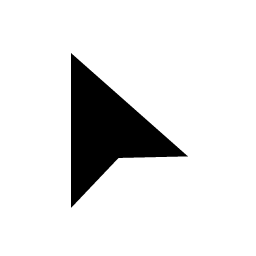

<!-- rumdl-disable MD023 MD033 MD041 -->

<div align="center">
  <table>
    <thead>
      <tr>
        <th>Layout</th>
        <th>Classic</th>
        <th>Rosé Pine</th>
        <th>Rosé Pine<br />Moon</th>
        <th>Rosé Pine<br />Dawn</th>
        <th>Gruvbox<br />Dark</th>
        <th>Gruvbox<br />Light</th>
        <th>Catppuccin<br />Latte</th>
        <th>Catppuccin<br />Frappé</th>
        <th>Catppuccin<br />Macchiato</th>
        <th>Catppuccin<br />Mocha</th>
      </tr>
    </thead>
    <tbody>
      <tr>
        <th>Modern</th>
        <td></td>
        <td></td>
        <td></td>
        <td></td>
        <td></td>
        <td></td>
        <td></td>
        <td></td>
        <td></td>
        <td></td>
      </tr>
      <tr>
        <th>Modern Right</th>
        <td></td>
        <td></td>
        <td></td>
        <td></td>
        <td></td>
        <td></td>
        <td></td>
        <td></td>
        <td></td>
        <td></td>
      </tr>
      <tr>
        <th>Original</th>
        <td></td>
        <td></td>
        <td></td>
        <td></td>
        <td></td>
        <td></td>
        <td></td>
        <td></td>
        <td></td>
        <td></td>
      </tr>
      <tr>
        <th>Original Right</th>
        <td></td>
        <td></td>
        <td></td>
        <td></td>
        <td></td>
        <td></td>
        <td></td>
        <td></td>
        <td></td>
        <td></td>
      </tr>
    </tbody>
  </table>

# Bibata Cursor

  Custom Bibata color variants and source layouts for my Nix cursor packages.

  [](https://github.com/adam01110/bibata-cursor/releases/latest)
  [](https://github.com/adam01110/bibata-cursor)
  <br />
  [](https://nixos.wiki/wiki/Flakes)
  [](https://bun.sh)
  [](LICENSE)

  [Overview](#overview) - [Variants](#variants) - [Usage](#usage)
  <br />
  [Building](#building) - [Packaging](#packaging) - [Layout](#layout) - [Credits](#credits)
</div>

I created this fork to support themed versions of Bibata Cursor in Nix
packages. It provides the rendered bitmap sources used to build matching
XCursor and Hyprcursor themes.

The repository is a fork of
[`LOSEARDES77/Bibata-Cursor-hyprcursor`](https://github.com/LOSEARDES77/Bibata-Cursor-hyprcursor),
which is itself a fork of the original
[`ful1e5/Bibata_Cursor`](https://github.com/ful1e5/Bibata_Cursor).

## Overview

- Renders reproducible Bibata bitmap sets from the original SVG sources.
- Keeps Modern, Modern Right, Original, and Original Right source layouts.
- Publishes each configured color variant as a separate release archive.
- Provides handedness-aware `ctgen` and Hyprcursor conversion files used by my
  NUR packages.
- Includes a Nix development shell and treefmt checks for repository tooling.

## Variants

| Palette | Base | Outline | Activity |
| --- | --- | --- | --- |
| Classic | `#000000` | `#FFFFFF` | `#000000` |
| Rosé Pine | `#26233A` | `#E0DEF4` | `#191724` |
| Rosé Pine Moon | `#393552` | `#E0DEF4` | `#232136` |
| Rosé Pine Dawn | `#F2E9E1` | `#464261` | `#FAF4ED` |
| Gruvbox Dark | `#504945` | `#FBF1C7` | `#282828` |
| Gruvbox Light | `#D5C4A1` | `#282828` | `#FBF1C7` |
| Catppuccin Latte | `#EFF1F5` | `#4C4F69` | `#E6E9EF` |
| Catppuccin Frappé | `#303446` | `#C6D0F5` | `#292C3C` |
| Catppuccin Macchiato | `#24273A` | `#CAD3F5` | `#1E2030` |
| Catppuccin Mocha | `#1E1E2E` | `#CDD6F4` | `#181825` |

## Usage

Rendered PNG archives are available from
[GitHub Releases](https://github.com/adam01110/bibata-cursor/releases/latest).
They are build inputs rather than directly installable cursor themes.

The finished Gruvbox Dark XCursor and Hyprcursor packages are published through
my [NUR repository](https://github.com/adam01110/nur). Follow the
[NUR installation guide](https://github.com/nix-community/NUR#installation),
then install both packages for combined XCursor and Hyprcursor support:

```nix
{
  home.packages = with pkgs.nur.repos.adam0; [
    bibata-modern-cursors-gruvbox-dark
    bibata-modern-cursors-gruvbox-dark-hyprcursor
  ];
}
```

## Building

The repository includes an [`.envrc`](.envrc) that uses the Nix flake development
shell. With [direnv](https://direnv.net/) installed and hooked into your shell,
allow it once and install the locked JavaScript dependencies:

```bash
direnv allow
bun install --frozen-lockfile
```

Without direnv, enter the same shell manually with `nix develop`.

Render every palette and layout combination configured in `render.json`:

```bash
bun run generate
```

The generated PNG assets are written to `bitmaps/<variant>`. Rendering uses up
to four workers by default. Override the worker count when more CPU and memory
are available:

```bash
BIBATA_GENERATE_JOBS=8 bun run generate
```

To change or add a color variant, add another entry to `render.json`. Each color
mapping replaces the source SVG's base, outline, or activity color during
rendering. Keep entries for all four layouts when a palette should be available
across the complete cursor set.

The source layout symlinks can be regenerated after changing files under
`svg/groups`:

```bash
bun run link
```

## Packaging

The downstream packages in
[`adam01110/nur`](https://github.com/adam01110/nur) fetch both this source tree
and a rendered bitmap archive. They use [`build.toml`](build.toml) with `ctgen`
to build an XCursor theme:

```bash
ctgen build.toml \
  -d bitmaps/Bibata-Modern-Gruvbox-Dark \
  -n Bibata-Modern-Gruvbox-Dark \
  -c "Gruvbox dark Bibata modern XCursors"
```

Use [`build.right.toml`](build.right.toml) instead when packaging a theme whose
name ends in `-Right`. It contains the right-handed hotspots required by the
mirrored pointer artwork; using `build.toml` would produce incorrect click
positions.

The Hyprcursor package then converts the generated theme:

```bash
bash scripts/build-hyprcursor.sh
```

## Credits

- [Bibata Cursor](https://github.com/ful1e5/Bibata_Cursor), designed by
  [Abdulkaiz Khatri](https://github.com/ful1e5)
- [Bibata Cursor Hyprcursor](https://github.com/LOSEARDES77/Bibata-Cursor-hyprcursor)
- [Wedge Loading Animation](https://loading.io/spinner/wedges/-pie-wedge-pizza-circle-round-rotate)
- [Adwaita](https://github.com/GNOME/adwaita-icon-theme)
- [DMZ](https://github.com/GalliumOS/dmz-cursor-theme)
- [Yaru](https://github.com/ubuntu/yaru)
